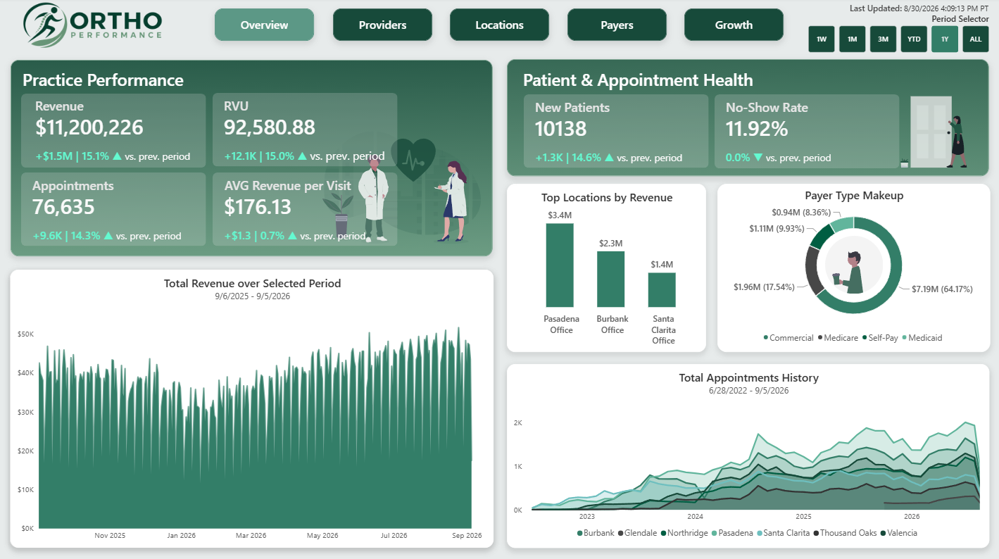
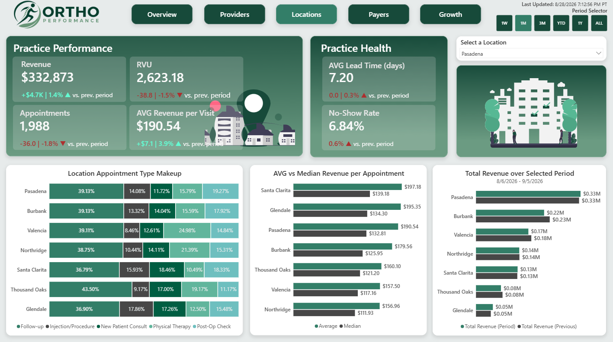
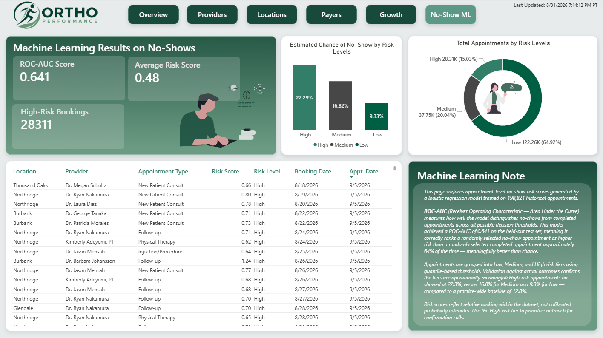

# Orthopedic Healthcare Performance Dashboard


<p align="center">
  
  <br>
  <em>Analysis overview generated in Power BI.</em>
  <br><br>
  
  <br>
  <em>A breakdown across orthopedic locations across Southern California.</em>
  <br><br>
  
  <br>
  <em>A machine learning overview on no-shows and risks of upcoming appointments.</em>
</p>

An interactive Power BI dashboard designed to analyze the operational
and financial performance of an orthopedic healthcare organization
across locations, providers, appointments, and payer types. Includes machine-learning to predict no-shows appointments and risk.

## Dashboard Overview

The report is organized into six analytical pages, each addressing a 
distinct operational and financial domain of the practice. A shared 
**Period Selector** (`1W · 1M · 3M · YTD · 1Y · ALL`) drives all 
period-based KPIs and prior-period comparisons simultaneously across 
every page.

| Page | Purpose |
|---|---|
| **Overview** | High-level snapshot of revenue, appointments, RVU, new patients, and no-show rate across the full practice |
| **Providers** | Provider-level productivity table with sparklines, appointment volume, revenue, RVU, lead time, no-show rate, and new patient conversion |
| **Locations** | Cross-location comparison of revenue, appointment type composition, and average vs. median revenue per appointment |
| **Payers** | Payer mix breakdown by type and individual payer, reimbursement rate differences, and revenue trend by payer type over time |
| **Growth** | Patient acquisition trends by referral channel, call-type outcomes, and revenue seasonality by calendar month |
| **No-Show Risk** | Machine learning-powered no-show risk stratification with a High-risk appointment call list and tier validation chart |

---

## Key Business Questions

The dashboard is designed to help answer questions such as:

-   How is overall revenue changing over time?
-   Which locations generate the most revenue and appointments?
-   Which providers have the highest appointment and revenue
    productivity?
-   How does payer mix affect revenue?
-   How are Medicare, Medicaid, commercial, and self-pay revenues
    distributed?
-   Are appointment volumes and revenue growing consistently?
-   How many new patients are being acquired?
-   Where are no-show or lead-time issues occurring?
-   How effectively are incoming calls converting into booked
    appointments?
-   How does performance change between selected periods?

## Key Findings

### Revenue & Financial Performance
- Total revenue across the full dataset period (Jun 2022–Sep 2026) was **$28,984,786** across **198,821 appointments**, with an average revenue per completed visit of **$176.08** and total RVU of **239,437.15**
- Commercial payers dominate revenue at **63.68% ($18.46M)**, followed by Medicare at **18.05% ($5.23M)**, Self-Pay at **10.02% ($2.90M)**, and Medicaid at **8.25% ($2.39M)**
- Commercial payers generate the highest average revenue per appointment at **$197.86**, versus **$165.35** for Medicare, **$148.99** for Medicaid, and **$86.23** for Self-Pay — a **2.3× spread** from top to bottom, illustrating the direct financial impact of payer mix decisions on per-visit revenue

### Location Performance
- Pasadena leads all locations in total revenue at **$9.0M**, followed by Burbank at **$6.0M**, Santa Clarita at **$4.5M**, Valencia at **$4.1M**, Northridge at **$3.1M**, Thousand Oaks at **$1.9M**, and Glendale at **$0.4M**
- Glendale reports the highest average revenue per appointment at **$205.72**, though the wide gap between its average and median (**$136.83**) indicates a small number of high-value procedure appointments skew the mean — characteristic of a newer, lower-volume satellite office with a single surgical provider
- Pasadena's average vs. median revenue per appointment (**$189.88** vs. **$133.85**) reflects a similar right-skew, consistent with its concentration of Spine Surgery and Hand & Upper Extremity cases
- Appointment type composition is broadly similar across locations — Follow-up visits constitute 37–42% everywhere — but Pasadena and Burbank carry the highest Injection/Procedure shares (**14.02%** and **13.83%** respectively), reflecting their surgical provider concentration relative to PT-heavy locations like Valencia (24.13% Physical Therapy)

### Provider Productivity
- Dr. Kenneth Hoffman (Spine Surgery, Pasadena) leads all providers with **11,057 appointments**, **$2,234,390** in revenue, **17,500.83 RVU**, and the lowest no-show rate in the practice at **5.73%**
- Dr. Sandra Petrov (Orthopedic Surgery, Pasadena) ranks second with **10,965 appointments** and **$2,005,487** in revenue
- Revenue per RVU ranges from **$127.67** (Dr. Hoffman) to **$110.70** (Kimberly Adeyemi, PT), reflecting reimbursement rate differences between high-complexity surgical procedures and physical therapy sessions
- No-show rates vary significantly across providers — from **5.73%** (Dr. Hoffman) to **22.63%** (Dr. Ryan Nakamura, Sports Medicine, Northridge) — a nearly **4× spread**, suggesting provider specialty, location, and patient population are stronger drivers of no-show behavior than any single scheduling factor
- New Patient Conversion ranges from **84.04%** (Dr. Hoffman) to **66.72%** (Dr. Nakamura), consistent with the same provider pattern observed in no-show rates
- Average booked lead time is consistent across providers at approximately **7.2–7.8 days**, confirming scheduling patterns are practice-wide rather than provider-driven

### Patient Acquisition & Growth
- The practice acquired **26,500 new patients** over the dataset period, with **Physician Referral** as the dominant acquisition channel — driving **83K total appointments** and **11K new patients**, more than double any other channel
- Self-referral generated **40K appointments** and **5K new patients**; Insurance Directory and Online Search each contributed approximately **28K appointments** and **4K new patients** respectively; Friend/Family contributed **20K appointments** and **3K new patients**
- Total front-desk calls received: **47,300**, with an overall Call-to-Booking rate of **47.24%**


### No-Show & Scheduling Risk
- Practice-wide no-show rate is **12.12%** across all appointments
- Median lead time is **7 days** (mean: 7.36 days, std: 5.02, range: 0–31 days), with 75% of appointments booked within 11 days — a tight booking window consistent with outpatient specialty care

### No-Show Risk Model
- A logistic regression model was trained on **189,907 appointments** (Completed and No-Show status; Cancelled excluded) with an 80/20 train/test split, achieving a **ROC-AUC of 0.641** on the held-out test set
- Features used: appointment lead time, day of week, month, appointment type, provider specialty, location, payer, is_new_patient
- Quantile-based risk tiers: **High — 28,311 appointments (15.03%)**, **Medium — 37,750 (20.04%)**, **Low — 122,260 (64.92%)**
- Validation against actual outcomes confirmed operationally meaningful stratification: High-risk appointments no-showed at **22.29%**, Medium at **16.82%**, and Low at **9.33%** — a **2.4× spread** around the 12.12% practice baseline
- The High-risk tier surfaces as a prioritized call list in the dashboard, enabling front-desk staff to focus confirmation outreach on the appointments most likely to result in a lost scheduling slot

## Key Metrics

Total Revenue, Total RVU, Total Appointments, New Patients, No-Show Rate, Average Lead Time, Median Lead Time, Average Revenue per Completed Appointment, Median Revenue per Completed Appointment, Average Revenue per RVU, Call-to-Booking Rate, New Patient Conversion, Revenue by Payer Type (Medicare %, Medicaid %, Commercial %, Self-Pay %), Revenue and appointment trends, Location-level and provider-level performance comparisons, Period-over-period growth.

## Data Model

The report uses a star-schema relational model centered on appointment activity.

### Core Tables

-   `public appointments` --- appointment dates, status, revenue, RVU,
    location, provider, and appointment type
-   `public patients` --- patient information and first-visit/referral
    attributes
-   `public providers` --- provider information, specialty, and primary
    location
-   `public locations` --- location names and geographic attributes
-   `public payers` --- payer names and payer classifications
-   `public calls` --- call activity, call type, and outcomes
-   `Date` --- dedicated calendar/date dimension used for time-based
    analysis, generated through Bravo

Relationships between these entities allow all operational, financial, and patient metrics to respond consistently to report filters.

## Project Structure
```
ortho-dashboard/
│
├── bi/
│   └── ortho_bi.pbix            # Power BI dashboard
├── data/                        # Generated by generate_data.py
│   ├── appointments.csv
│   ├── calls.csv
│   ├── locations.csv
│   ├── patients.csv
│   ├── payers.csv
│   └── providers.csv
├── db/
│   ├── __init__.py
│   ├── base.py
│   ├── init_db.py
│   ├── models.py
│   └── session.py
├── images/
│   ├── ortho_growth.png
│   ├── ortho_locations.png
│   ├── ortho_overview.png
│   ├── ortho_payers.png
│   └── ortho_providers.png
├── notebook/
│   ├── data_cleaning.ipynb
│   └── no_show_model.ipynb
├── generate_data.py             # Synthetic data generation
├── load_data.py                 # ETL: transform and load to PostgreSQL
├── README.md
└── requirements.txt
```

## How to Use

1. Open `bi/ortho_bi.pbix` in Power BI Desktop to explore the dashboard.

**Optional:**

2. Run `generate_data.py` to regenerate the synthetic datasets from the current seed. The generator is configurable to produce data at different scales or time ranges.
3. Review the `db/` folder for the SQLAlchemy models and session setup used to initialize and connect to PostgreSQL.
4. Open the notebooks in `notebook/` to see the data cleaning pipeline and the no-show prediction model built with scikit-learn.

## Tools Used

**PostgreSQL** was used to store and query the synthetic dataset — 199,076 appointments, 47,551 calls, 25,858 patients, 7 payers, 27 providers, and 7 locations across Southern California. Tables were designed with normalized relationships and loaded via SQLAlchemy. SQL was used throughout for data validation, row-count checks, and verifying referential integrity across joins before connecting to Power BI.

**Power BI Desktop** is the primary analytics layer. The report uses a star-schema data model through import mode, a dedicated `Date` table generated via Bravo for proper time-intelligence, and a custom `Period Selector` table driving dynamic period filtering across all five pages. Visuals include KPI cards with conditional color formatting, line and bar trend charts, clustered comparisons, donut charts for payer mix, and a detailed provider-level table. A report-level filter excludes "Unknown Provider" records from all visuals.

**DAX** powers the measure library, including period-aware aggregations (`Total Revenue (Period)`, `Total Appointments (Period)`), KPI label and color logic tied to period-over-period comparisons, time-intelligence measures using the `Date` table, and derived metrics such as `AVG Revenue per RVU`, `No-Show Rate`, `Call-to-Booking Rate`, and `New Patient Conversion`. Measures are organized in a dedicated `_Measures` table separate from the data model.

**Python (pandas, SQLAlchemy)** handled synthetic data generation and the ETL pipeline. `generate_data.py` produces realistic healthcare operations data with configurable parameters. `load_data.py` uses pandas for transformation and SQLAlchemy bulk operations to load CSVs into PostgreSQL. The `data_cleaning.ipynb` notebook documents the cleaning logic applied before loading.

**scikit-learn** was used in `no_show_model.ipynb` to prototype a no-show prediction model on the appointment dataset. The model achieved a ROC-AUC of 0.641 on a held-out test set and produced risk scores for 189,907 appointments, stratified into tiers that demonstrated a 2.4× difference in actual no-show rates between High-risk (22.29%) and Low-risk (9.33%) appointments, enabling prioritized patient confirmation outreach.

**Bravo for Power BI** was used to generate the `Date` dimension table, providing a clean calendar spine with standard time-intelligence attributes (year, month, quarter, day) without manual DAX table construction.

## License

This project is licensed under the MIT License.

## Credits and Data Sources
The dataset used in this project is synthetic data generated with assistance from Anthropic's Claude and iteratively refined through prompt engineering to produce realistic healthcare operations, appointment, provider, location, payer, and financial patterns.

The data was intentionally designed and adjusted to support the analytical questions addressed by the dashboard. It does not represent real patients, providers, healthcare organizations, or actual financial performance.

The Power BI data model, DAX measures, time-intelligence logic, visualizations, dashboard design, and analytical framework were developed as part of this project.
